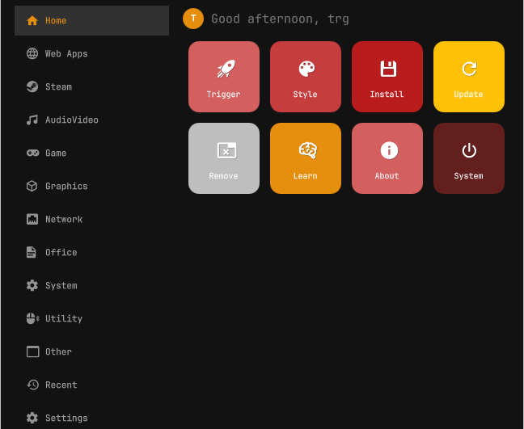
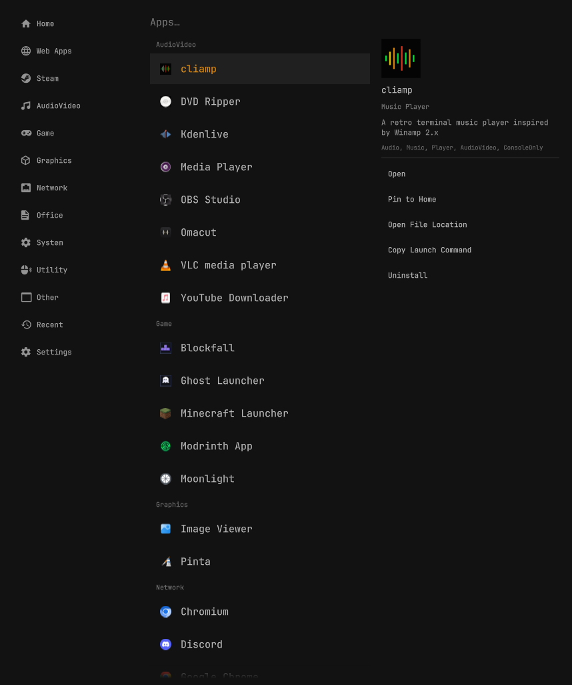

# trg-menu

A Windows-11-inspired rebuild of [Omarchy](https://omarchy.org)'s application
menu — a sidebar, a real Home screen with pinned/recent apps, and apps
browsable by category — built as a drop-in replacement for the stock
`omarchy.menu` plugin. Everything Omarchy's menu is required to do (keyboard
shortcuts, the `select`/`input` dmenu-style pickers other Omarchy tools use,
JSONC customization) keeps working underneath; the visual layer on top is
completely custom.





## Features

- **Sidebar navigation** — Home, Web Apps, Steam, one destination per
  installed app category (Game, Development, Graphics, ...), Recent,
  Settings. The category list is dynamic: it only ever shows categories you
  actually have apps in.
- **Home screen** — a greeting header, a Pinned row, a Recent row (real
  launch history, not fake data), and a tile grid for everything else.
- **Steam gets its own space.** Steam-installed games are detected and kept
  entirely separate from your regular Apps list — not just visually grouped,
  actually a different destination — so Steam repeatedly rewriting its
  `.desktop` files can never affect anything else's position in Apps.
- **Category browsing** — native apps are grouped by their real freedesktop
  category, each with its own Sidebar entry and its own view.
- **Pin apps to Home**, straight from the Apps/Web Apps/Steam info panel.
- **Full keyboard navigation** — arrow keys, search-as-you-type, Tab to move
  into/out of the Sidebar, Enter/Backspace, all preserved from the original.
- **Theme-aware.** Colors come from your active Omarchy theme
  (`colors.toml`/`shell.toml`), not a hardcoded palette.

## What's unchanged underneath

- IPC lifecycle (`omarchy-shell shell summon omarchy.menu ...`), including
  the `select`/`input` dmenu modes other Omarchy tools (theme picker, font
  picker, power profile picker, etc.) depend on.
- `~/.config/omarchy/extensions/omarchy-menu.jsonc` customization — icons,
  labels, sort order, hidden entries all keep working exactly as before.
- Application discovery via Quickshell's `DesktopEntries`.

## Installing

This plugin's manifest declares `"clonedFrom": "omarchy.menu"`, which is
what tells Omarchy's shell to disable the stock menu and route its
keybindings (e.g. `SUPER+ALT+SPACE`) to this one instead. That wiring is
only set up by `omarchy plugin clone`, so install it that way rather than
`omarchy plugin add`:

```bash
# 1. Create a properly-wired clone slot (disables the stock menu, rewires
#    keybindings to it). This creates ~/.config/omarchy/plugins/<you>.menu.
omarchy plugin clone omarchy.menu

# 2. Fetch this repo's files and drop them into that slot — everything
#    except manifest.json, which the clone step already generated correctly
#    for your username.
git clone https://github.com/<your-username>/trg-menu.git /tmp/trg-menu
cp /tmp/trg-menu/*.qml /tmp/trg-menu/*.js ~/.config/omarchy/plugins/"$(id -un)".menu/
rm -rf /tmp/trg-menu

# 3. Restart the shell to pick up the structural changes.
omarchy restart shell
```

Your existing `~/.config/omarchy/extensions/omarchy-menu.jsonc`
customizations (if you have any) are read as-is — nothing to change there.

## Uninstalling

```bash
omarchy plugin remove "$(id -un)".menu
```

## Architecture

| File | Responsibility |
|---|---|
| `Menu.qml` | Orchestrator: IPC lifecycle, shared state, guard evaluation, keyboard handling, card/window chrome |
| `MenuData.js` | JSONC parse/merge/route-resolve/search logic, Sidebar destination list |
| `AppSource.qml` | App discovery (Quickshell `DesktopEntries`), Web App/Steam detection, category classification, icon resolution/caching, launch/uninstall |
| `Sidebar.qml` | Persistent left-hand navigation |
| `HomeView.qml` / `AppTileRow.qml` | Home screen: Pinned/Recent/More tile sections |
| `ListMenuView.qml` / `AppBrowserView.qml` | Row list and the Apps/Web Apps/Steam/category/Recent split view with info panel |
| `AppInfoPanel.qml` | App details + actions (Open, Pin, Open File Location, Copy Launch Command, Uninstall) |
| `PinStore.qml` / `RecentStore.qml` | Persisted pinned-apps and recently-launched lists |
| `ThemePalette.qml` | Reads the active theme's palette for tile colors and design tokens |

See `CHANGELOG.md` for the bugs found and fixed while building this.

## License

MIT — see `LICENSE`.
